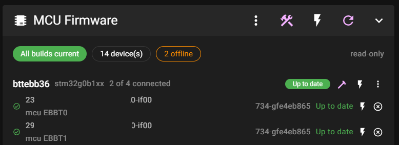
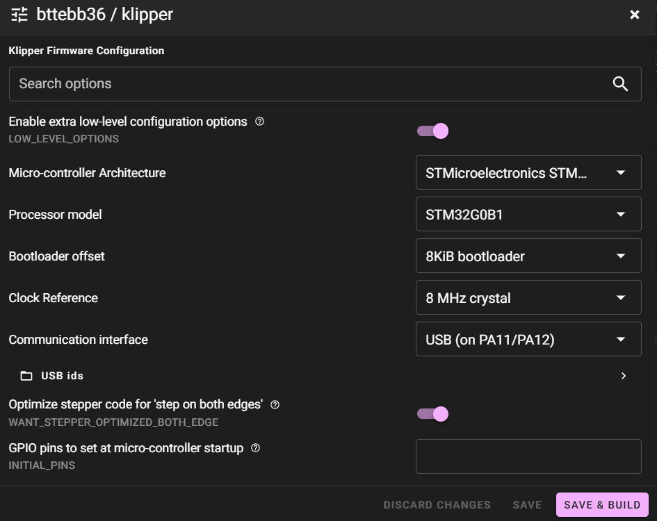
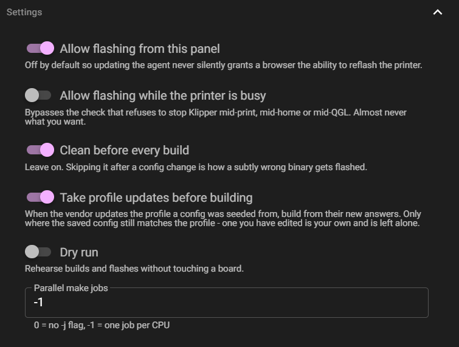
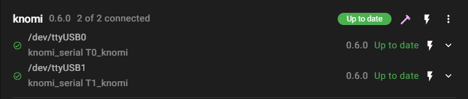
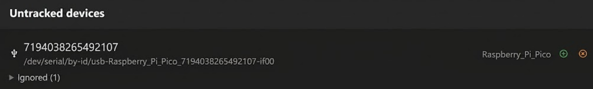

# mcu-updater



Firmware management for a Klipper printer with more than one MCU. It keeps a
registry of your board types and the USB serials of the physical boards of each
type, remembers each type's `menuconfig` answers, builds Klipper and Katapult,
and flashes every board — so "Klipper updated, now reflash six toolheads" is one
command instead of an afternoon. Driven from the CLI or from the [web
UI](#web-ui) shown above.

Linux only (it needs `/dev/serial/by-id`, systemd and `sudo`). Python 3.9+,
standard library only — no pip dependencies, no virtualenv.

## Contents

- [Features](#features)
- [TODO](#todo)
- [Requirements](#requirements)
- [Usage](#usage)
- [Web UI](#web-ui)
- [Configuration](#configuration)
  - [Firmware families](#firmware-families)
  - [Profiles](#profiles)
  - [ESP32 displays](#esp32-displays)
- [Layout](#layout)
- [Development](#development)
  - [Checking that a guard is load-bearing](#checking-that-a-guard-is-load-bearing)
  - [Line endings](#line-endings)

## Features

Build systems ("builders" — one module + one registry line to add another):
- [x] `kconfig_make` — Klipper, Katapult, and forks (menuconfig + make)
- [x] `platformio` — anything with a `platformio.ini`
- [ ] prebuilt images — download a release asset instead of building

Flashing:
- [x] `flashtool.py` — Katapult over USB, STM32 and RP2040
- [x] `dfu-util` — bare STM32, first bootloader install
- [x] `esptool` — ESP32, via PlatformIO
- [ ] RP2040 BOOTSEL — copy a `.uf2` to the mounted volume
- [ ] CAN — `flashtool.py -i <iface> -u <uuid>`
- [ ] Katapult deployer — replaces a bootloader; no software recovery if wrong

Firmware and boards:
- [x] Multiple firmware families, each with its own tree and builder
- [x] Multiple firmwares per board type
- [x] Per-type saved menuconfig answers, per firmware
- [x] Per-type Makefile patches
- [x] Vendor profile seeding, custom profiles, drift detection
- [x] Flash-time bootloader offset check
- [x] Board tracking by `/dev/serial/by-id` serial
- [ ] CAN device discovery (needs `canbus_uuid` from printer.cfg)

Interfaces:
- [x] CLI and interactive TUI
- [x] Moonraker agent (JSON-RPC over the unix socket)
- [x] Mainsail panel, including menuconfig in the browser
- [x] Bulk build / flash / update-all
- [x] Guided first-time MCU setup over DFU
- [ ] Standalone embeddable UI (today it is a Mainsail fork)
- [ ] Event-driven bus watching via pyudev (today: adaptive polling)

## TODO

- Finish the schema-first rebuild tracked in
  [docs/rebuild-plan.md](docs/rebuild-plan.md) — config vocabulary, the
  Cartographer flash-path bugs, the flash-time bootloader offset check, and the
  legacy-key purge it drives.
- Decide stable-or-beta for the Mainsail fork before tagging: it sits three
  commits past `v2.18.4-vylyne.14`, which was never promoted to stable, so the
  existing Flash All / Build All fixes haven't reached anyone's update manager.
- Generalise `needs_klipper_stopped` into a per-type "services to stop" list —
  deferred until it can land together with that list, not as a bare rename.
- Reproduce and fix the flaky teardown `RuntimeError` in
  `test_an_unknown_inbound_method_gets_an_error_not_silence`.

## Requirements

- Klipper checked out at `~/klipper`
- [Katapult](https://github.com/Arksine/katapult) at `~/katapult` (for the
  `flashtool.py` used to flash over USB/CAN) — override with `flashtool_path`
  in `[updater]` if it lives somewhere else, e.g. a fork
- An ARM toolchain and `make`, i.e. whatever already builds Klipper for you
- `python3-serial` — Katapult's `flashtool.py` imports it. `install.sh` offers to
  apt-install it, because without it a flash fails part-way through with Klipper
  already stopped.
- `dfu-util`, only for installing Katapult onto a brand-new STM32 board
- Passwordless `sudo` for `systemctl {start,stop} klipper`

## Usage

```bash
~/mcu-updater/src/updatefw.py            # interactive menu
~/mcu-updater/src/updatefw.py status     # what's tracked, built, and online
```

| Command | What it does |
| --- | --- |
| `status` | Every tracked type: whether its firmware is stale, and whether each board is online as Klipper, sitting in the Katapult bootloader, or offline |
| `add-type -t NAME -c CHIPSET` | Register a board model |
| `add-serial -t NAME -s SERIAL` | Track a physical board under a type |
| `remove-type` / `remove-serial` | The inverse |
| `profiles -t NAME` | List the vendor answer files this type's firmware tree ships |
| `apply-profile -t NAME -p config.CartoV4USB [-f FW]` | Seed a type's menuconfig answers from one, deriving Katapult's to match |
| `menuconfig -t NAME -f FW` | Configure a type, saved per type so it survives rebuilds |
| `build -t NAME -f FW [--no-reseed]` | Compile and stage the artifact |
| `flash -t NAME [-s SERIAL]` | Flash one board, or every board of a type |
| `update-all` | Stop Klipper, rebuild and reflash everything, start Klipper |
| `add-mcu -t NAME` | Guided first-time Katapult install on a new board |

`FW` is `klipper`, `katapult`, or the name of any declared [firmware
family](#firmware-families). `apply-profile` defaults `-f` to whichever family
the type runs, so it's only needed to seed a different target (Katapult's own
config, say). `build --no-reseed` builds the saved config as it stands even if
its profile has moved on since — see [reseed_on_build](#profiles).

Useful flags: `--dry-run` (global) rehearses anything without building or
flashing a thing; `-j N` on `build`/`update-all` for parallel make; `-y` to skip
confirmation prompts; `--force` where a prompt guards something destructive. On
`flash`, `--force` only applies flashing a single device with `-s SERIAL` — it
overrides a refused [bootloader offset check](#profiles), never a whole type or
`update-all`, where one board's exception would otherwise force every board in
the batch past a check that exists to stop a fleet-wide brick.

## Web UI

Everything above also works from a browser instead of SSH. A Moonraker agent
(`src/mcu_updater/agent`) talks to a small fork of Mainsail —
[Vylyne/mainsail](https://github.com/Vylyne/mainsail) — that adds a native "MCU
Firmware" panel to the Machine page. Mainsail has no plugin API, so a real panel
needs a fork; [docs/mainsail-fork.md](docs/mainsail-fork.md) covers how it's kept
small and rebaseable against upstream.

Same registry, same `mcu-updater.cfg`, same builds — the panel shown at the top
of this page lists every tracked type, whether its firmware is current, and
whether each board is online, expandable down to the individual serial.

**Kconfig in the browser**, seeded from a vendor [profile](#profiles) instead of
an empty menu:



**Settings**, including the switch that turns on flashing:



**ESP32 displays tracked alongside the MCUs:**



**Boards on the bus that aren't tracked yet, one tap to adopt:**



`install.sh` sets up the agent and prints the one-line `moonraker.conf` change
that points Mainsail's Update Manager at the fork instead of upstream. See
[docs/agent-api.md](docs/agent-api.md) for the JSON-RPC contract between the two.

Flashing from the panel is **off by default** — installing or updating the
agent never silently grants a browser the ability to write to a board. Turn it
on with `enable_flashing` (below) in the cfg, or with the toggle in the panel's
own Settings, shown above.

## Configuration

### `~/printer_data/config/mcu-updater/mcu-updater.cfg`

One file: tool settings and the MCU registry. Klipper-style, because it sits next
to `printer.cfg` and gets hand-edited — and **your comments survive** the panel
writing to it.

```ini
# Every value here has a default, so this whole section is optional.
[updater]
enable_flashing: true      ; let the web UI flash boards. Off by default.
make_jobs: 0               ; 0 = no -j flag, negative = one per CPU
clean_before_build: true   ; leave on: a stale object mix flashes a wrong binary
reseed_on_build: true      ; take a vendor's updated profile answers before building
service: klipper           ; klipper-1, klipper-2... for KIAUH multi-instance

# Toolhead boards. The buffer patch is specific to this batch.
[mcu flylllplusbuffer]
chipset: stm32f072xb
serials:
    4C0033000957465331323720-if00
    3F0037000957465331323720-if00
klipper_makefile_patches:
    src/Makefile -> src-y += buffer.c
```

`[mcu <name>]` is the classic spelling and still works — it's shorthand for
`[type <name>]` with `provider: kconfig_make`, the Kconfig+`make` build system
klipper and katapult both use. ESP32 displays are the other provider
(`[display <name>]`, i.e. `provider: platformio` — see [ESP32
displays](#esp32-displays)). A section keeps whatever spelling it already has;
write `[type <name>]` yourself only if you want the spelling to say so.

Per-type keys:

- **`chipset`** — required; matches the chipset segment of the by-id name.
- **`serials`** — one tracked board per line.
- **`firmware`** — which family this board actually runs, e.g. `cartographer`.
  Defaults to `klipper`. See [Firmware families](#firmware-families).
- **`katapult_installed`** — only written when `false`; a board with no
  bootloader is the exception.
- **`profile`** — the vendor answer file this type's config is seeded from, e.g.
  `config.CartoV4USB`. Names a file in that firmware's *own source tree*, not
  one shipped here. See [Profiles](#profiles).
- **`<fw>_extra_args`** — appended to the `make` command line. `<fw>` is
  `klipper`, `katapult`, or a declared family's name.
- **`<fw>_makefile_patches`** — `<file> -> <line>`, appended to that Makefile
  *for one build only*, then reverted. This exists because Klipper's build system
  has no way to add `src-y +=` lines from the command line, and a permanent edit
  would leak into every other type sharing that chipset and conflict on the next
  `git pull` of Klipper.

Edit the existing `[updater]` section rather than appending a second one — a
duplicate section is refused, because first-wins would make the settings in the
later copy silently do nothing.

`mcu-updater.cfg` at the repo root is a real example copied from a working printer.

> **`makefile_patches` makes your firmware version say `-dirty`.** Klipper stamps
> the version from git while the patch is applied, so the tree is briefly dirty.
> `v0.13.0-712-g6d43f8b3-dirty-...` is expected for a patched type and does not
> mean you have local Klipper modifications.

### Firmware families

Every type builds klipper and katapult by convention: source at `~/<name>`,
output at `out/<name>.bin`. A vendor fork breaks both. Cartographer's firmware
is a Klipper fork that lives in `~/MCU-Firmware---Based-on-Klipper` and, being
a Klipper fork, still drops `out/klipper.bin`. Declare the mismatch once:

```ini
[firmware cartographer]
source: ~/MCU-Firmware---Based-on-Klipper
artifact: klipper           ; what the build actually leaves in out/
```

then point a type at it:

```ini
[mcu carto_v4]
chipset: stm32g431xx
firmware: cartographer
```

Both keys are optional, and so is the section itself — with none declared,
every family resolves to the plain convention, which is every install
predating this. `menuconfig -f`/`build -f` take `cartographer` exactly like
`klipper` or `katapult`, and so do `cartographer_extra_args` /
`cartographer_makefile_patches`. Which flasher writes the board is still
chosen by chipset, not by family, since one firmware can need `dfu-util` on an
STM32 board and BOOTSEL on an RP2040 one.

### Profiles

A Cartographer V4's `.config` is 138 lines. **Seven** of them are answers:

```ini
CONFIG_LOW_LEVEL_OPTIONS=y            # Enable extra low-level configuration options
CONFIG_MACH_STM32=y                   # Micro-controller Architecture → STM32
CONFIG_MACH_STM32G431=y               # Processor model → STM32G431
CONFIG_STM32_CLOCK_REF_24M=y          # Clock Reference → 24 MHz crystal
CONFIG_SCANNER=y                      # SCANNER
CONFIG_CARTOGRAPHER_G431_ENABLE=y     # SCANNER model → CARTOGRAPHER V4
CONFIG_VERSION="CARTOGRAPHER 6.2.0"   # Firmware version string
```

The other 131 — `USBSERIAL`, `CANSERIAL`, `FLASH_APPLICATION_ADDRESS`,
`CLOCK_FREQ`, every `WANT_*` — are computed from those seven. The CAN build adds
exactly one answer (`STM32_CANBUS_PA11_PA12`); the "lite" build adds exactly one
more (`FOR_K1`, which means Creality K1, not "feature-reduced").

```bash
updatefw.py profiles -t carto_v4
updatefw.py apply-profile -t carto_v4 -p config.CartoV4USB
```

**The answers come from the firmware tree, not from this repo.** Cartographer
ships `config.CartoV4USB` and seven siblings in their fork's root. Copying those
lines here would make us the owner of somebody else's hardware definition, and it
would go stale visibly: `CONFIG_VERSION` is maintained by hand in those files, so
the tree's own Kconfig default still says `6.0.0` while every shipped config says
`6.2.0`. The seed is loaded and re-emitted rather than copied — what `make
olddefconfig` does, minus the terminal — so a `git pull` of the fork picks up
both the next bump and any symbol added since.

**Katapult is derived from the application, not seeded.** There is no vendor
config for it, and a second table describing the same board is how two configs
drift apart. Every answer Katapult's tree *also defines* is carried across;
`SCANNER`, `CARTOGRAPHER_G431_ENABLE` and `VERSION` are dropped by that same
test. Then the one thing that matters is checked: Katapult's `LAUNCH_APP_ADDRESS`
must equal the application's `FLASH_APPLICATION_ADDRESS`. Those agreeing is the
whole of "the board boots", and they are separate answers in separate trees that
each build and flash perfectly happily when wrong — so a disagreement is refused
with both addresses named, rather than discovered afterwards.

**That only checks our own two configs against each other** — it cannot see
what bootloader is actually on a given board, which may be the vendor's own
prebuilt one rather than anything built here. So flashing an application asks
the board directly first: `flashtool.py --status` connects to the bootloader
and reads the same address the write would use, but writes nothing — and
refuses before the real write if the two disagree. A second check runs against
what the write itself reported, in case the board changed in the moment
between the two; by then the write has already happened, so that one can only
report loudly, not prevent it.

**Nothing is locked.** A seeded `.config` is an ordinary one that `menuconfig`
still edits; what this adds is that `status` then says `Customised` instead of
saying nothing. A lock users cannot override just gets worked around by editing
the file on disk, and then nobody knows. `apply-profile` refuses to overwrite a
config it did not write — `--force` replaces it and keeps a `.bak`.

**Editing one isn't a dead end.** The moment something would reseed over a
customised config — `apply-profile --force`, or the automatic reseed below —
your edited answers are kept first, as this type's own profile
(`config.custom`). `profiles -t NAME` lists it alongside the vendor's, marked
"yours"; `apply-profile -t NAME -p config.custom` gets you back.

**Vendor bumps are taken automatically, never over your own edits.** With
`reseed_on_build` on (the default), a build first checks whether the profile a
config was seeded from has moved on — the vendor pushed a new
`config.CartoV4USB` — and reseeds from it before compiling. It only fires when
the saved config still matches what the profile last wrote; a `Customised`
config is always left alone. `build --no-reseed` skips the check for one build.

> Three answers are worth knowing you can break, out of that whole menu: the
> **clock reference** (wrong and the board never enumerates), the
> **communication interface** (mismatched to how it is wired and the board
> vanishes — and a CAN build has no software route to ROM DFU, because Klipper
> sets `STM32_DFU_ROM_ADDRESS` to 0 without USB), and the **bootloader offset**.
> The rest is genuinely inert for a board like this.

### ESP32 displays

Knomis and anything else PlatformIO builds, managed alongside the MCUs:

```ini
# mcu-updater.cfg
[updater]
pio_source: ~/knomi_serial         # one repo, shared by every env (was display_source)

[display knomi_toolchanger]        # the section name is the PlatformIO env by default
```

`[display <name>]` is shorthand for `[type <name>]` with `provider: platformio`
— the same aliasing `[mcu ...]` gets, see [above](#configuration). A section's
own `source:` overrides `pio_source`, and `platformio_bin` in `[updater]`
points at `pio` if neither the `PATH` nor `~/.platformio/penv/bin/pio` finds it.

| Key | Meaning |
| --- | --- |
| `env` | The PlatformIO env, if it differs from the section name |
| `source` | This display's own source tree, overriding `pio_source` |
| `klipper_section` | The `printer.cfg` prefix its displays are declared under. Default `knomi_serial` |
| `service` | The systemd unit watching its ports, paused while flashing. Default `knomi_serial`; blank means nothing to pause |
| `device_map` | Where that watcher writes its id → port map, relative to `printer_data`. Default `knomi/devices.json` |

Every key defaults to what a Knomi needs, so a bare `[display
knomi_toolchanger]` is still enough for the common case — the three that
usually change are for a second display family with its own klippy module and
port watcher.

The screens themselves are not listed here — `[knomi_serial T0_knomi]` in
`printer.cfg` already names its port, and a second copy would only be something
to disagree with.

A few things to know:

- **A port is never inferred.** `pio run -t upload` picks one on its own when
  told nothing, and every screen is an indistinguishable CH340 — so an upload
  that guesses writes firmware to the wrong display. Every write pins its port.
- **A udev symlink is resolved first.** `pio device list` enumerates through
  pyserial, which reports `/dev/ttyUSB0` and never the `/dev/knomi_t0` pointing
  at it, so PlatformIO handed the symlink looks for a board on a port it cannot
  see. The resolution happens at the moment of the write, with Klipper already
  stopped, and is printed to the log — the stable name stays what the config
  names and what the MAC record is keyed on.
- **A UART-attached ESP32 needs one line in its `platformio.ini`.** The board
  manifest for a native-USB ESP32-S3 asks PlatformIO to reset the board and then
  adopt whatever *new* serial port appears. A Knomi v2 drives its LCD from those
  USB pins and talks over a CH340, which stays on the bus and keeps the same
  port — so nothing new ever appears and the upload times out on a healthy
  screen. Put this in the env:

  ```ini
  [env:knomi_toolchanger]
  board_upload.wait_for_upload_port = no
  ```

  It can only go there. `board_upload.*` is a `platformio.ini` setting and
  `pio run` has no command-line override for it (`--project-option` belongs to
  `pio ci` and `pio project init`). An upload that hits this is recognised and
  the error names the file, the section and the line to add.
- **A missing screen is otherwise invisible.** The klippy module runs as a no-op
  when a port won't open, so Klipper starts happily with a blank display and no
  error. `fw.display.list` is the only thing that says so.

## Layout

Files are split by what they are — see [docs/layout.md](docs/layout.md) for the
reasoning.

```
~/mcu-updater/src/updatefw.py        entry point (a shim onto the package)

~/printer_data/config/mcu-updater/   hand-edited, backed up, editable in Mainsail
    mcu-updater.cfg                      settings + the MCU registry
    types/<type>/<fw>.config             saved menuconfig answers
    types/<type>/<fw>.custom.config      your own answers, kept before a reseed would overwrite them

~/printer_data/mcu-updater/          generated, not backed up
    <type>/<fw>.bin                      built firmware
    <type>/<fw>.build.json               build provenance, for staleness checks
    <type>/<fw>.profile.json             what was seeded, for drift detection
```

Config lives under `config/` so it's backed up and reachable by Mainsail's own
editor. Firmware binaries deliberately don't: backup tools git-commit everything
in that directory, so a `.bin` there means a binary churn commit after every
build — and they're regenerable anyway.

The per-type folders sit under `types/` so `mcu-updater.cfg` is the only thing
in the directory that editor opens. They used to be directly in it; an existing
install is moved across on the next run and told what moved.

Staleness compares recorded provenance — the source-tree commit and a hash of
the `.config` used — rather than file timestamps. So `status` correctly reports
every board as stale after you pull Klipper, and a stray `touch` doesn't lie.

## Development

```bash
pip install -e ".[dev]"
pytest -q
ruff check src tests scripts
```

### Checking that a guard is load-bearing

A guard no test exercises is decoration, and a passing suite cannot tell you
which kind you have. `scripts/mutation_test.py` breaks each one deliberately and
reports whether the suite noticed:

```bash
./scripts/mutation_test.py scripts/mutations/bulk-operations.json
```

`CAUGHT` means removing the guard fails a test, so it is real. `SURVIVED` means
nothing covers it. The specs under `scripts/mutations/` record the guards that
matter; `STALE` means an anchor no longer matches the source and the spec needs
updating, which is not the same as being covered.

It edits files in place, so it restores in a `finally`, verifies the restore by
hash afterwards, and keeps a backup outside the tree. That is not
belt-and-braces: an earlier ad-hoc version of this crashed *between* mutating and
restoring and left a sabotaged guard on disk.

### Line endings

LF everywhere, in the repo *and* the working tree — `.gitattributes` pins
`* text=auto eol=lf`, because this ships to a Linux printer host where a `\r` in
a shebang becomes `bad interpreter: python3^M`.

Git handles checkout and commit; what it cannot see is a file rewritten in place
afterwards, which on Windows is one careless `Path.write_text` away. The suite
checks for it, and the fix is one command:

```bash
python scripts/check_line_endings.py          # report
python scripts/check_line_endings.py --fix    # rewrite as LF
```

Worth having because the symptom points somewhere else entirely: anchors are
matched as bytes, so a CRLF file misses *every* multi-line one at once and the
mutation harness reports a wall of `STALE` — which reads as "the code moved",
not "the file has carriage returns".

The whole test suite runs on any OS with no printer attached, because every
filesystem location comes from a `Paths` object that honours these overrides:

| Variable | Replaces |
| --- | --- |
| `MCU_UPDATER_HOME` | `~` |
| `MCU_UPDATER_PRINTER_DATA` | `~/printer_data` |
| `MCU_UPDATER_CONFIG_DIR` | `…/config/mcu-updater` |
| `MCU_UPDATER_DATA_DIR` | `…/mcu-updater` |
| `MCU_UPDATER_FAKE_BUS` | `/dev/serial/by-id` |

`MCU_UPDATER_FAKE_BUS` is worth knowing about: `touch` and `rm` files named
`usb-<fw>_<chipset>_<serial>` in that directory to simulate a board
re-enumerating between Klipper and Katapult, and combine it with `--dry-run` for
a complete end-to-end rehearsal with no hardware and no risk.
